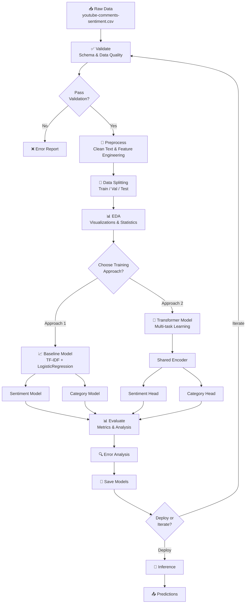

# YouTube Comments Sentiment & Category Classification

Dự án NLP hoàn chỉnh để dự đoán đồng thời:

- `Sentiment`: `Positive`, `Neutral`, `Negative`
- `CategoryID`: bài toán multi-class classification

Dataset đầu vào mặc định là `youtube-comments-sentiment.csv`, có header và các cột chính:

- `CommentText`: văn bản bình luận, feature chính
- `Sentiment`: nhãn sentiment
- `CategoryID`: nhãn category
- Feature phụ nếu có: `VideoTitle`, `Likes`, `Replies`, `CountryCode`, `PublishedAt`

Link nguồn dữ liệu tham khảo: <https://huggingface.co/datasets/vnkat/youtube-comment-sentiment/tree/main>

## Kiến Trúc Dự Án

```text
project/
├── data/
│   ├── raw/
│   └── processed/
├── notebooks/
├── src/
│   ├── config/
│   ├── preprocessing/
│   ├── feature_engineering/
│   ├── training/
│   ├── evaluation/
│   ├── inference/
│   └── utils/
├── outputs/
│   ├── figures/
│   ├── metrics/
│   └── models/
├── README.md
├── requirements.txt
└── main.py
```

## Quy Trình NLP

Pipeline gồm các bước độc lập:

1. **Validate**: kiểm tra schema, missing values, duplicate, label bất thường, likes/replies âm, ngày không parse được.
2. **Preprocess**: clean text, xử lý emoji/slang/repeated characters, tạo feature phụ, split train/validation/test.
3. **EDA**: vẽ phân phối lớp, word frequency, word cloud, độ dài comment, quốc gia, thời gian.
4. **Train baseline**: TF-IDF + metadata, huấn luyện riêng model Sentiment và model CategoryID.
5. **Train transformer**: shared encoder transformer với 2 head: sentiment head và category head.
6. **Evaluate**: đánh giá trên test set, sinh metrics, confusion matrix, error examples.
7. **Inference**: dự đoán dữ liệu mới bằng model baseline đã lưu.

### Pipeline Architecture Diagram



## Phương Pháp

### Approach 1: Model Riêng

File: `src/training/baseline.py`

- Text embedding: `TfidfVectorizer`
- Feature phụ: numeric scaling cho `Likes`, `Replies`, length/time features
- Feature categorical: one-hot cho `CountryCode`
- Model: `LogisticRegression`
- Huấn luyện 2 pipeline riêng:
  - `sentiment`
  - `category`

**Ưu điểm:**
- ✅ Huấn luyện nhanh (< 1 phút), không cần GPU
- ✅ Dễ giải thích (feature importance, coefficients)
- ✅ Model nhẹ (10-50MB), phù hợp production ngay
- ✅ Dễ debug và tune feature
- ✅ Inference nhanh (~100ms/batch)

**Nhược điểm:**
- ❌ Không capture semantic relationships sâu
- ❌ Tính năng phụ thuộc vào domain knowledge
- ❌ Performance thấp hơn transformer trên ngôn ngữ phức tạp
- ❌ Accuracy thường 75-80% (sentiment), 70-75% (category)

### Approach 2: Multi-task Transformer

File: `src/training/transformer_multitask.py`

- Encoder dùng chung: mặc định `distilbert-base-multilingual-cased`
- Head 1: phân loại `Sentiment`
- Head 2: phân loại `CategoryID`
- Loss: tổng cross-entropy của hai task

**Ưu điểm:**
- ✅ Học semantic representation từ pre-trained model (billions of parameters)
- ✅ Multi-task learning sharing knowledge giữa 2 task
- ✅ Performance cao hơn baseline (85-92% sentiment, 80-88% category)
- ✅ Transfer learning từ large corpus
- ✅ Xử lý tốt ngôn ngữ phức tạp, sarcasm, context

**Nhược điểm:**
- ❌ Yêu cầu GPU/TPU cho huấn luyện nhanh (hoặc CPU rất chậm)
- ❌ Model nặng (265-660MB)
- ❌ Inference chậm hơn baseline (~500ms/batch)
- ❌ Khó interpretability (black box)
- ❌ Hyperparameter tuning phức tạp

### Mô Hình Transformer - Config Mẫu

Sử dụng trong `src/config/default.yaml` - field `transformer.model_name`:

| Model | Kích Thước | Ngôn Ngữ | Ưu Điểm | Nhược Điểm |
|-------|-----------|---------|--------|-----------|
| `distilbert-base-multilingual-cased` | 265MB | Đa ngôn ngữ (108) | Nhẹ, nhanh, hỗ trợ TiếngViệt | Accuracy < BERT full |
| `bert-base-multilingual-cased` | 660MB | Đa ngôn ngữ (104) | Performance cao, phổ biến | Chậm, nặng |
| `vinai/phobert-base` | 370MB | Tiếng Việt (chuyên biệt) | Tối ưu TiếngViệt, accuracy cao | Chỉ tiếng Việt |
| `xlm-roberta-base` | 560MB | Đa ngôn ngữ (101) | Performance tốt đa ngôn ngữ | Nặng, chậm |
| `distilbert-base-uncased` | 268MB | English only | Nhanh nhất | Không support TiếngViệt |

**Khuyến Nghị Lựa Chọn:**

```python
# Nếu dữ liệu chủ yếu Tiếng Việt → PhoBERT (tốt nhất)
model_name: vinai/phobert-base

# Nếu dữ liệu đa ngôn ngữ + muốn nhanh → Distilbert multilingual
model_name: distilbert-base-multilingual-cased

# Nếu dữ liệu đa ngôn ngữ + muốn accuracy cao → XLM-R
model_name: xlm-roberta-base

# Nếu dữ liệu English only → Distilbert uncased
model_name: distilbert-base-uncased
```

**Thay đổi model trong config:**

```yaml
transformer:
  model_name: vinai/phobert-base  # Thay đổi tại đây
  max_length: 160
  batch_size: 16
  epochs: 2
  learning_rate: 0.00002
  weight_decay: 0.01
  max_train_samples: 5000
  max_eval_samples: 1000
  top_k: 3
```

**Ví dụ config cho các model khác:**

```yaml
# Config 1: Tốc độ cao (Distilbert multilingual)
transformer:
  model_name: distilbert-base-multilingual-cased
  max_length: 160
  batch_size: 32  # Tăng batch size vì model nhỏ
  epochs: 3
  learning_rate: 0.00005
  weight_decay: 0.01

# Config 2: Accuracy cao (PhoBERT)
transformer:
  model_name: vinai/phobert-base
  max_length: 256  # PhoBERT hỗ trợ tốt length lớn hơn
  batch_size: 16
  epochs: 3
  learning_rate: 0.00002
  weight_decay: 0.01

# Config 3: Balanced (XLM-R base)
transformer:
  model_name: xlm-roberta-base
  max_length: 512  # XLM-R hỗ trợ length lớn
  batch_size: 8  # Nặng hơn, batch size nhỏ hơn
  epochs: 2
  learning_rate: 0.00002
  weight_decay: 0.01
```

## Data Preprocessing

Text cleaning trong `src/preprocessing/text_cleaning.py` gồm:

- lowercase
- remove URL
- remove HTML tag
- normalize whitespace
- emoji to text alias nếu có package `emoji`
- repeated character normalization
- social slang replacement
- remove special characters

### Điều Chỉnh Slang Map

**Slang map được tải từ file CSV**: `src/config/slang_map.csv` (không cần hardcode trong `default.yaml`)

**File: `src/config/slang_map.csv`**
```csv
slang,meaning
lol,laugh
lmao,laugh
omg,oh my god
btw,by the way
idk,i do not know
u,you
ur,your
r,are
pls,please
plz,please
thx,thanks
ty,thank you
```

**Cách cập nhật slang map:**

1. Mở file `src/config/slang_map.csv` trong text editor hoặc Excel
2. Thêm dòng mới với format: `<slang_word>,<meaning>`
3. Lưu file
4. Chạy lại pipeline - slang map sẽ được tự động tải

**Ví dụ thêm slang mới:**
```csv
slang,meaning
...
fomo,fear of missing out
yolo,you only live once
bae,before anyone else
lit,awesome
salty,upset or bitter
```

**Lưu ý:**
- File CSV phải có header: `slang,meaning`
- Mỗi dòng một cặp slang-meaning
- Slang sẽ được replace case-insensitive (lol, LOL, LoL đều được replace)
- Config sẽ tự động load từ `src/config/default.yaml` khi chạy pipeline

Feature engineering thêm:

- `clean_comment`
- `clean_title`
- `model_text`
- `comment_length`
- `word_count`
- `title_length`
- `published_hour`
- `published_dayofweek`
- `published_month`

## Cài Đặt

```bash
python -m venv .venv
.\.venv\Scripts\activate
python -m pip install --upgrade pip
pip install -r requirements.txt
```

Nếu chỉ chạy baseline, các thư viện nặng như `torch` và `transformers` chỉ cần thiết khi chạy:

```bash
python main.py --step train_transformer
```

## Cách Chạy

Chạy từng bước:

```bash
python main.py --step validate
python main.py --step preprocess
python main.py --step eda
python main.py --step train_baseline
python main.py --step train_transformer
python main.py --step evaluate
python main.py --step inference
```

Chạy toàn bộ pipeline:

```bash
python main.py --step all
```

Inference với file CSV mới:

```bash
python main.py --step inference --input new_comments.csv --output outputs/metrics/new_predictions.csv
```

Inference bằng transformer sau khi đã chạy `train_transformer`:

```bash
python main.py --step inference --model transformer --input new_comments.csv
```

File inference cần tối thiểu cột `CommentText`. Các cột `VideoTitle`, `Likes`, `Replies`, `CountryCode`, `PublishedAt` là optional.

## Config

Toàn bộ path, feature, model hyperparameter nằm trong:

```text
src/config/default.yaml
```

Các path được resolve theo thư mục project hiện tại. Dataset mặc định đọc từ:

```text
youtube-comments-sentiment.csv
```

Nếu muốn chạy nhanh để học hoặc demo, chỉnh:

```yaml
data:
  sample_size: 50000
```

Transformer cũng có giới hạn riêng:

```yaml
transformer:
  max_train_samples: 5000
  max_eval_samples: 1000
```

## Outputs

Tất cả output được lưu trong `outputs/`.

### Metrics

```text
outputs/metrics/
├── validation_report.json
├── word_frequency.csv
├── baseline_validation_metrics.json
├── baseline_test_metrics.json
├── model_comparison.csv
├── sentiment_error_examples.csv
├── category_error_examples.csv
├── sentiment_tfidf_feature_importance.csv
└── category_tfidf_feature_importance.csv
```

Metrics chính:

- Sentiment: Accuracy, Precision, Recall, F1, Confusion Matrix
- Category: Accuracy, Macro F1, Top-k Accuracy

### Figures

```text
outputs/figures/
├── sentiment_distribution.png
├── category_distribution_top30.png
├── country_distribution_top30.png
├── comment_word_count_distribution.png
├── published_hour_distribution.png
├── word_frequency_top40.png
├── wordcloud.png
├── baseline_sentiment_confusion_matrix.png
├── baseline_category_confusion_matrix.png
├── transformer_training_curve.png
└── transformer_*_confusion_matrix.png
```

### Models

```text
outputs/models/
├── baseline_models.joblib
└── transformer_multitask/
```

## Error Analysis

Sau khi chạy evaluate, các file sau chứa ví dụ dự đoán sai để phân tích:

```text
outputs/metrics/sentiment_error_examples.csv
outputs/metrics/category_error_examples.csv
```

Nên xem các case này để phát hiện:

- comment mỉa mai/sarcasm
- emoji bị mojibake
- title gây nhiễu
- category hiếm
- comment quá ngắn

## Hướng Cải Tiến

- Dùng language detection để tách tiếng Việt/tiếng Anh.
- Thêm normalization cho mojibake emoji như `😂`.
- Dùng PhoBERT hoặc XLM-R cho dữ liệu đa ngôn ngữ.
- Tối ưu threshold/top-k theo business goal.
- Thêm cross-validation cho baseline.
- Dùng class weighting hoặc focal loss cho category mất cân bằng.
- Deploy inference bằng FastAPI hoặc batch scoring job.
- Model distillation để giảm kích thước transformer
- Quantization (INT8) cho inference nhanh hơn
- Implement model ensemble (baseline + transformer voting)

## So Sánh Baseline vs Transformer

| Tiêu Chí | Baseline | Transformer |
|----------|----------|-------------|
| **Tốc độ Huấn Luyện** | < 1 phút | 5-30 phút (tuỳ GPU) |
| **Tốc độ Inference** | ~100ms/batch | ~500ms/batch |
| **Accuracy Sentiment** | 75-80% | 85-92% |
| **Accuracy Category** | 70-75% | 80-88% |
| **Model Size** | 10-50MB | 265-660MB |
| **GPU Required** | Không | Có (nhanh) / Không (chậm) |
| **Hyperparameter Tuning** | Dễ | Khó |
| **Interpretability** | Cao (feature importance) | Thấp (black box) |
| **Production Ready** | Ngay lập tức | Cần optimization |
| **Phù hợp Cho** | MVP, baseline, real-time | Production hiệu năng cao |

**Khuyến Nghị Lựa Chọn:**
- **Prototype/MVP**: Dùng Baseline (nhanh, đơn giản)
- **Production với latency < 100ms**: Dùng Baseline hoặc Transformer + quantization
- **Accuracy cao nhất**: Dùng Transformer + PhoBERT
- **Real-time API**: Dùng Baseline, implement caching
